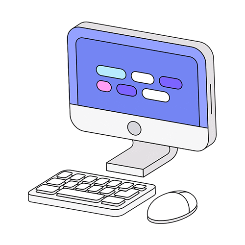

<h1 align="center">
   💻 Univesp course completion page 💻
</h1>

<h4 align="center">
  😉 Finalization project of the Univesp Foundation Course, with the aim of practicing the technologies learned!
</h4>

## Photo 🎴
   

   
   

   

   
   <a href="#On">On</a> .
   <a href="#Roadmap">Roadmap</a> .
   <a href="#Technologies">Technologies</a> .
   <a href="#Photo">Photos</a> . 
   <a href="#Author">Author</a> 
   
 

   
 ## On ✔
     
     
   
 The project aims to improve practices with Html and CSS, and learn a little more about W3, to improve the development of web sites!! 

   
   
   
 ## Roadmap 🗺
   
   
The project was a great immersion for me, as I was able to learn more about the technologies I currently use and also be able to learn more about what 
   I had not experienced yet !!

   
   
 ## Technologies 🚀
   
   <h3 align="center"> Technologies used in the project 🙃 </h3>
   
   

- [Html](https://developer.mozilla.org/pt-BR/docs/Web/HTML/Element/html/)  
- [CSS](https://developer.mozilla.org/pt-BR/docs/Web/CSS)  
- [W3Schools](https://www.w3schools.com/)  

 
 
   
## Author 🙋🏾‍♂️
   
 Hello, my name is João.   Follow me on <a href="https://www.linkedin.com/in/joaosoaressilva/" target="_blank">Linkedin</a> to see more about the projects I post.!

